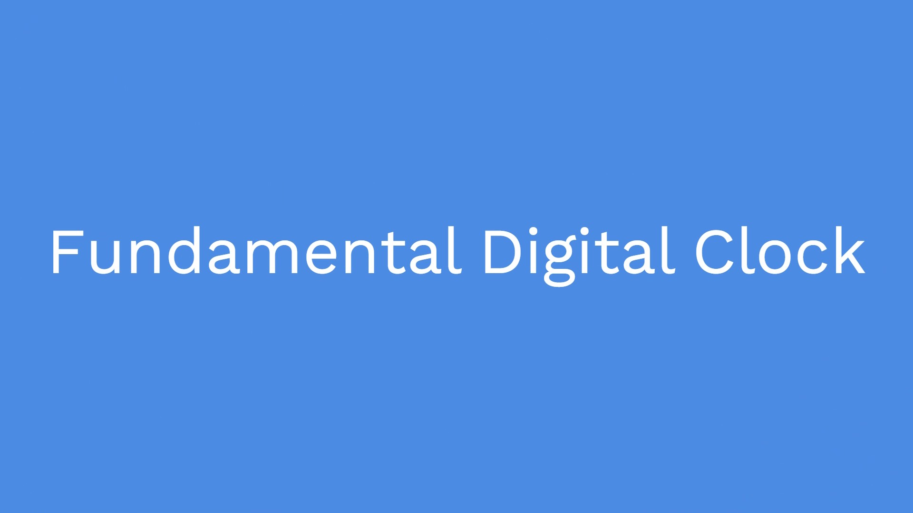

# fundamental-digital-clock

## Introduction
This is the final project of Embedded Developer Course at FSoft Academy which is a Training Academy of FPT Software.

This project uses MCU S32K from NXP, 2 buttons, 1 8-digit 7-segment LED Display (chip MAX7219), and 1 USB-UART converter.

## Requirements
* After power on, display date in format 00-00-00 and time in format 01.01.2971.
* Setting date and time by UART communication.
* Press button 1 to change between displaying date and display time.
* Press button 2 to turn on and turn off.

## Solution
I designed a small Finite State Machine to fulfil the requirements of this project. This FSM has 7 states:
* **MAIN_SYSTEM_INIT**: Initialize system.
* **SETTING_TIME**: system wait for time information from computer through UART communication protocol.
* **SETTING_DATE**: system wait for date information from computer through UART communication protocol.
* **DISPLAY_TIME**: display time information.
* **DISPLAY_DATE**: display date information
* **OFF_1**: stop display anything when displaying date.
* **OFF_2**: stop display anything when displaying time.

## Demo Video
This video shows the digital clock running on the NXP S32K MCU with UART-based time/date setting and 8-digit 7-segment display output.
